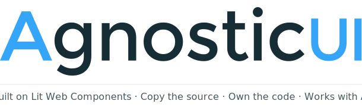
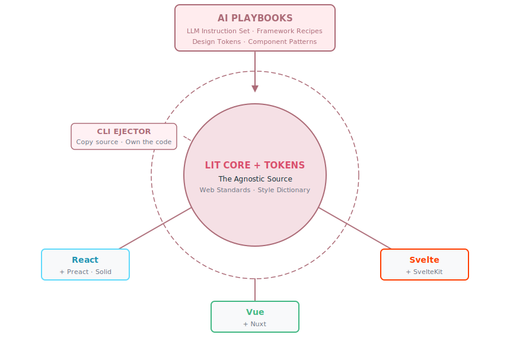

<p align="center">
  
</p>

<br />

<p align="center">
  <strong>One component library. Every framework.</strong>
</p>

<p align="center">
  <a href="https://agnosticui.com/docs">Documentation</a> ·
  <a href="https://agnosticui.com/playbooks">AI Playbooks</a> ·
  <a href="https://agnosticui.com/components">Components</a> ·
  <a href="#quick-start">Quick Start</a>
</p>

<br />

---

## The problem with every other component library

Most component libraries make a quiet assumption: you'll stay in their ecosystem. You install the package, you import their components, and from that moment forward their versioning, their breaking changes, and their framework lock-in are your problem too.

And when you reach for an AI coding tool? It hallucinates props that don't exist, invents APIs it has never seen, and leaves you debugging output that looked correct but wasn't.

AgnosticUI is built on a different premise entirely.

---

## You own the source

```bash
npm install -g agnosticui-cli

cd my-project
npx agnosticui-cli init --framework react
npx agnosticui-cli add Button Card Input
```

That's it. No `node_modules` rabbit hole to trace. No opaque black box. The component source lands **directly in your project** — readable, editable, yours.

```
src/
  components/
    ag/
      Button/
        Button.tsx        ← your file now
        Button.css        ← your tokens now
        Button.test.ts    ← your tests now
```

Components land under `src/components/ag/` by default — a dedicated namespace that keeps AgnosticUI components cleanly separated from your own. The path is configurable if you prefer otherwise.

Your AI coding tools — Cursor, Windsurf, Copilot — can see every line. No hallucinated props. No invented APIs. Just real, local source code that your LLM reads like any other file in your project.

This is not a workaround. It is the architecture.

---

## Built once. Runs everywhere.

AgnosticUI's components are authored as **Lit Web Components** — a thin, standards-based layer over native Custom Elements. The CLI wraps them for your framework of choice at copy time.

<p align="center">
  
</p>

The same `Button` you use in a React app is the same `Button` your Vue team uses. Same tokens. Same accessibility semantics. Same test coverage. Your design system doesn't fork when your tech stack does.

| | AgnosticUI | Typical component library |
|---|---|---|
| Source in your repo | ✅ | ❌ |
| Framework agnostic core | ✅ | ❌ |
| LLM-readable locally | ✅ | ❌ |
| AI Playbooks included | ✅ | ❌ |
| Multiple theme skins | ✅ | Limited |
| Zero runtime dependency | ✅ after ejection | ❌ |

---

## AI Playbooks: your LLM already knows how to build with AgnosticUI

Playbooks are structured prompt recipes — one per UI pattern — that tell your AI coding tool exactly how AgnosticUI components compose, what props they accept, and how they should be assembled into real product UI.

| Playbook | What it builds |
|---|---|
| [Login Form](https://agnosticui.com/playbooks/login.html) | Responsive login page — mobile, tablet floating card, desktop two-column |
| [Onboarding Wizard](https://agnosticui.com/playbooks/onboarding.html) | Multi-step onboarding flow with progress, validation, and skip logic |
| [Discovery Dashboard](https://agnosticui.com/playbooks/dashboard.html) | Dashboard shell with header, sidebar, and data regions |
| [Support Center](https://agnosticui.com/playbooks/support.html) | Help center layout with search, categories, and article structure |

Each Playbook page on the docs site includes:

- **Live StackBlitz examples** for React, Vue, and Lit — runnable directly in the browser
- **`PROMPT-3-FRAMEWORKS.md`** — a ready-made LLM prompt to generate or customize the pattern across all three frameworks at once
- **Per-framework prompt files** (`PROMPT-REACT.md`, `PROMPT-VUE.md`, etc.) for targeted generation
- **Skin switcher** in every live example so you can preview your theme tokens instantly

Drop a Playbook prompt into Cursor or Claude Code. Ask it to build a login page. Watch it assemble `Input`, `Button`, `Card`, and `FormGroup` correctly on the first try — because it has the full recipe, not just a component reference.

No more prompt archaeology. No more correcting hallucinated props. The Playbook is the context your LLM was missing.

---

## Theme skins via CSS custom properties

AgnosticUI components expose their entire visual surface through CSS custom properties. Swap a skin file and every component in your project updates — no component code changes, no find-and-replace.

```css
/* Swap this file to change your entire product's look */
@import 'agnosticui/skins/brutalist.css';

/* Or author your own — every token is documented */
:root {
  --ag-primary: #your-brand;
  --ag-radius-md: 0px;           /* sharp corners */
  --ag-font-family-body: 'Your Font', sans-serif;
  --ag-shadow-lg: none;          /* flat design */
}
```

Ship your product with the default skin. Hand it to a designer. Get back a token file. Import it. Done — no component rewrites, no design handoff friction.

---

## Quick Start

```bash
npm install -g agnosticui-cli
```

**React**
```bash
cd my-react-app
npx agnosticui-cli init --framework react
npx agnosticui-cli add Button Card Input
```

**Vue**
```bash
cd my-vue-app
npx agnosticui-cli init --framework vue
npx agnosticui-cli add Button Card Input
```

**Svelte**
```bash
cd my-svelte-app
npx agnosticui-cli init --framework svelte
npx agnosticui-cli add Button Card Input
```

**Lit / Web Components directly**
```bash
cd my-lit-app
npx agnosticui-cli init --framework lit
npx agnosticui-cli add Button Card Input
```

After running `add`, your terminal prints the exact import path for your project. No guessing.

---

## Accessibility first, not last

Every AgnosticUI component ships with:

- Correct ARIA roles, states, and properties out of the box
- Keyboard navigation that follows WCAG 2.1 AA patterns
- Focus management that works with screen readers
- Reduced motion support via `prefers-reduced-motion`
- Color contrast validated against AA minimums in the default skin

Accessibility is not a checklist item applied at the end. It is part of the component contract that every skin and every framework wrapper must satisfy.

---

## 56 components. Production-ready.

**Core UI**
`Accordion` · `Alerts` · `AspectRatio` · `Avatar` · `Badge` · `Breadcrumb` · `Button` · `Card` · `Checkbox` · `Collapsible` · `Combobox` · `CopyButton` · `Dialog` · `Divider` · `Drawer` · `EmptyState`

**Forms & Inputs**
`Fieldset` · `Input` · `Radio` · `Rating` · `Select` · `SelectionButtonGroup` · `SelectionCardGroup` · `Slider` · `Toggle`

**Navigation & Layout**
`Header` · `Menu` · `Pagination` · `Sidebar` · `Tabs`

**Feedback & Status**
`Loader` · `Progress` · `ProgressRing` · `ScrollProgress` · `Skeleton Loader` · `Spinner` · `Toast`

**Content & Display**
`Icon` · `Icon Button` · `Image` · `IntlFormatter` · `Kbd` · `Link` · `Mark` · `MessageBubble` · `Popover` · `ScrollToButton` · `Table` · `Tag` · `Timeline` · `Tooltip` · `VisuallyHidden`

**Lab** *(experimental)*
`BadgeFx` · `ButtonFx` · `Flex` · `IconButtonFx` · `Sidebar`

---

## Contributing

AgnosticUI is open source and welcomes contributions. See [CONTRIBUTING.md](./CONTRIBUTING.md) for component authoring guidelines, the token system, and how to write Playbook entries.

---

## License

Apache License 2.0 © [AgnosticUI](https://agnosticui.com)

## Where is v1?

AgnosticUI v2 is a complete rewrite and is not compatible with v1. If you need v1, it remains available via git tags:
- Packages: `agnostic-angular`, `agnostic-react`, `agnostic-vue`, `agnostic-svelte`, etc.
- Tag: `v1-legacy`
