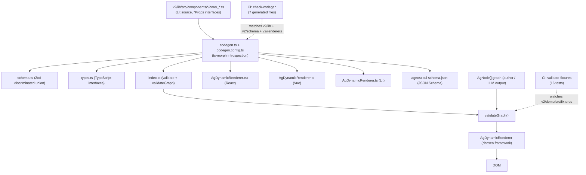
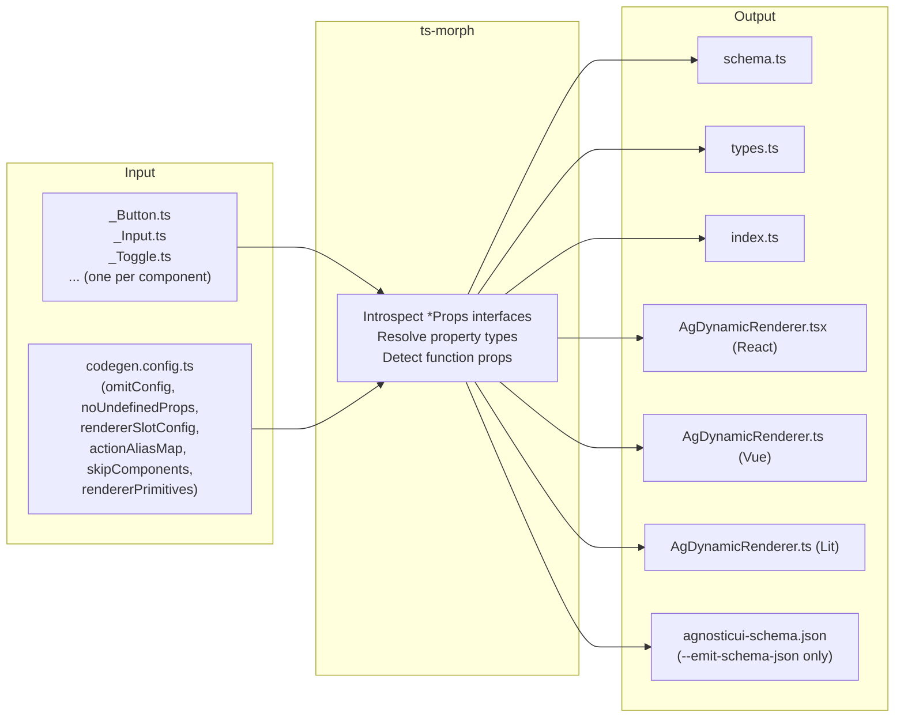
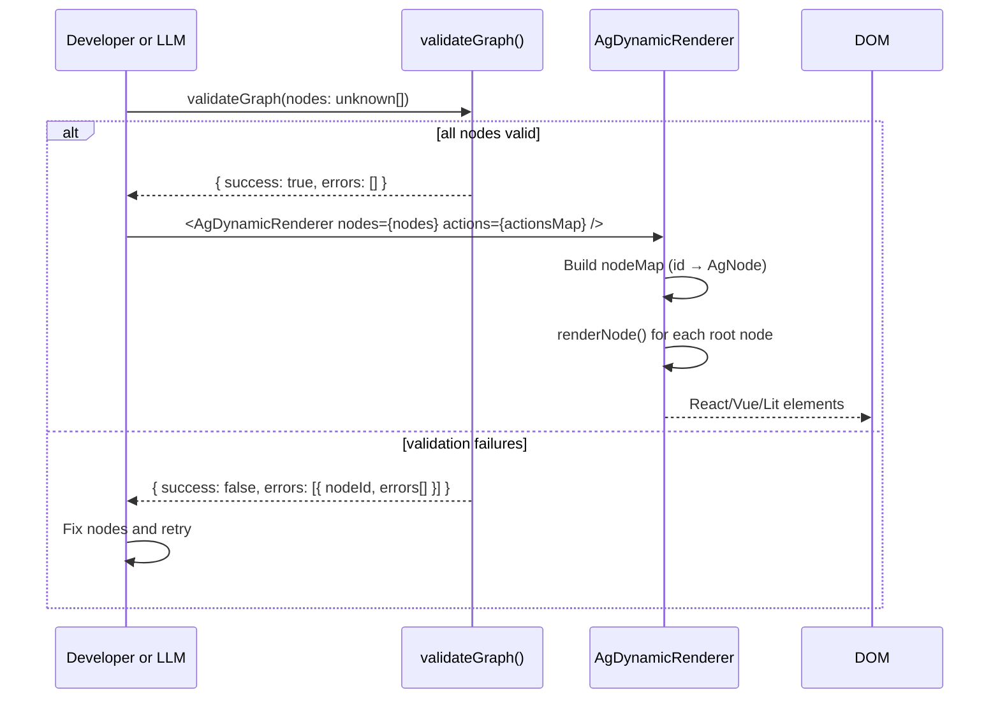

# SDUI Architecture

The AgnosticUI Schema-Driven UI (SDUI) system lets developers and LLMs describe interfaces as flat JSON node graphs instead of framework-specific JSX, templates, or HTML. A single `AgNode[]` array can be validated once and rendered by React, Vue, or Lit without modification. This document covers the full stack from the Lit component source files through code generation, schema validation, and framework rendering.

## Overview



---

## Codegen pipeline

`codegen.ts` uses [ts-morph](https://ts-morph.com/) to introspect every `*Props` TypeScript interface exported from `v2/lib/src/components/*/core/_*.ts`. It produces 6 source files plus an optional JSON Schema artifact in a single pass.

### Running codegen

```bash
# From v2/schema/
npm run codegen

# Also emit the JSON Schema for LLM/agent use
npm run codegen -- --emit-schema-json
```

### What codegen produces



### codegen.config.ts knobs

| Key | Purpose |
|---|---|
| `omitConfig` | Non-function props to exclude per component (runtime state, internal hooks) |
| `noUndefinedProps` | Props that must use conditional spread in React to avoid attribute removal |
| `actionAliasMap` | Maps function prop names (`onClick`) to SDUI string aliases (`on_click`) |
| `actionPayloadMap` | Expression to extract a serializable payload from the event argument |
| `rendererSlotConfig` | Controls whether a component renders `label-child`, `children`, or `none` |
| `typeOverrides` | Explicit Zod + TS type for props where auto-detection is wrong or external |
| `reactPropRenames` | JSX attribute name overrides (e.g. `ariaLabel` becomes `aria-label`) |
| `skipComponents` | Entire components excluded from all output (require runtime state) |
| `rendererPrimitives` | Hand-maintained node types with no Lit counterpart (e.g. `AgText`) |

### Skipped components

Components in `skipComponents` are excluded from all generated output because they require controlled runtime state that cannot be expressed in a static node graph. Current exclusions: `Collapsible`, `Combobox`, `Menu`, `Pagination`, `ScrollProgress`, `ScrollToButton`, `Sidebar`, `SidebarNav`, `Slider`, `Toast`, `VisuallyHidden`.

---

## Node graph model

An `AgNode[]` is a flat array of node objects. Each node has a required `id` (unique within the graph) and a required `component` field. All other fields are component-specific props. Container relationships are expressed through `children: string[]`, which holds the IDs of child nodes rather than nested objects.

### Example: a card with a heading and a button

```json
[
  {
    "id": "my-card",
    "component": "AgCard",
    "children": ["card-title", "card-action"]
  },
  {
    "id": "card-title",
    "component": "AgText",
    "text": "Welcome back",
    "el": "h2"
  },
  {
    "id": "card-action",
    "component": "AgButton",
    "variant": "primary",
    "children": ["card-action-label"]
  },
  {
    "id": "card-action-label",
    "component": "AgText",
    "text": "Get started"
  }
]
```

### Discriminated union

`AgNodeSchema` in `schema.ts` is a Zod `z.discriminatedUnion('component', [...])`. The `component` field is a string literal on every variant (`z.literal('AgButton')`, `z.literal('AgCard')`, etc.). Zod uses the `component` value to select the exact schema variant before validating any other field, which means:

- Type errors are reported against the correct variant's props.
- An LLM can read `component` and know exactly which props are valid without scanning all variants.
- TypeScript narrows the union automatically in `switch (node.component)` blocks.

---

## Node graph lifecycle



`validateGraph()` performs two passes:

1. Each node is validated with `validate()` against the Zod discriminated union schema.
2. Every string in a node's `children` array is checked against the set of all declared IDs in the graph. Missing refs produce errors with the form `child ref "<id>" not found in graph`.

Errors are returned as `GraphNodeError[]`, each containing the `nodeId` and an array of human-readable messages. The call never throws.

---

## Framework renderers

Three renderer files are generated at `v2/renderers/{react,vue,lit}/src/AgDynamicRenderer.{tsx,ts}`. Each contains:

- A `switch (node.component)` block mapping every component name to its framework wrapper.
- A `renderChildren(childIds)` helper that resolves IDs from the node map and renders recursively.
- An `actions` prop: `Record<string, (payload?: unknown) => void>`.

### The `actions` map

SDUI nodes carry string aliases for interactive callbacks (`on_click`, `on_change`, `on_dismiss`, etc.). When the renderer encounters an action alias, it calls `actions[alias]?.(payload)` — only aliases present in the caller's map are invoked. Unknown aliases are silently ignored. No `eval()` or dynamic code execution occurs; this is the XSS boundary.

### `noUndefinedProps` and the @lit/react problem

`@lit/react`'s `createComponent` passes all props through `Object.entries`, which includes entries whose value is `undefined`. For Lit web components that use `reflect: true` `@property` decorators in CSS `:host([size])` attribute selectors, receiving `undefined` removes the reflected attribute. This invalidates the entire CSS custom-property chain at computed value time (IACVT: Invalid At Computed Value Time), breaking component appearance even when the Lit constructor has default values.

The fix is a conditional spread in the generated React renderer:

```tsx
{...(node.size !== undefined ? { size: node.size } : {})}
```

This affects only the React renderer because Vue and Lit do not use `@lit/react`. Props requiring this treatment are declared in `noUndefinedProps` in `codegen.config.ts`.

### Renderer primitives

`rendererPrimitives` in `codegen.config.ts` defines hand-maintained node types that have no Lit component counterpart. The only current primitive is `AgText`, which renders to a plain HTML element (`span`, `p`, `h1-h4`, or `label`) with a `text` prop. The codegen appends primitives verbatim after the discovered-component output in every generated file.

---

## CI gates

### check-codegen

**Workflow:** `.github/workflows/check-codegen.yml`
**Trigger:** push or PR touching `v2/lib/src/components/**`, `v2/schema/**`, or `v2/renderers/**`
**Command:** `npm run check-codegen` (from `v2/schema/`)

This runs `check-codegen.ts`, which invokes codegen in dry-run mode and compares each of the 7 generated files against what codegen would produce. If any file differs, the step fails with a diff and exits non-zero.

**To fix a drift failure:** run `npm run codegen` (and `npm run codegen -- --emit-schema-json` if `agnosticui-schema.json` drifted), then commit the regenerated files.

### validate-fixtures

**Workflow:** `.github/workflows/validate-fixtures.yml`
**Trigger:** push or PR touching `v2/schema/**`, `v2/demo/src/fixtures/**`, or `v2/renderers/**`
**Command:** `npm test` (from `v2/demo/`)

Runs Vitest against `fixtures.spec.ts`, which calls `validateGraph()` on every variation in `fixtureBank` plus `pickerFixture`. Currently covers 16 fixture variations across multiple workflow types (login form, contact form, etc.).

---

## File layout

```
v2/
  lib/
    src/components/          One directory per component
      Button/core/_Button.ts   Source of truth: ButtonProps interface
      Input/core/_Input.ts
      Toggle/core/_Toggle.ts
      ...                    (57 total component directories)

  schema/                    @agnosticui/schema package
    src/
      schema.ts              Zod discriminated union (AgNodeSchema) — AUTO-GENERATED
      types.ts               TypeScript interfaces (AgNode, AgButtonNode, etc.) — AUTO-GENERATED
      validate.ts            validate() + validateGraph() — hand-maintained
      index.ts               Public exports — AUTO-GENERATED
    scripts/
      codegen.ts             ts-morph introspection + file generator
      codegen.config.ts      omitConfig, noUndefinedProps, rendererSlotConfig, etc.
      check-codegen.ts       Dry-run diff used by CI
      emit-schema-json.ts    JSON Schema output (--emit-schema-json flag)
    agnosticui-schema.json   JSON Schema for LLM/agent use — AUTO-GENERATED

  renderers/
    react/src/AgDynamicRenderer.tsx   React renderer — AUTO-GENERATED
    vue/src/AgDynamicRenderer.ts      Vue renderer — AUTO-GENERATED
    lit/src/AgDynamicRenderer.ts      Lit renderer — AUTO-GENERATED

  demo/                      React Vite demonstration app
    src/
      fixtures/
        index.ts             fixtureBank (AgNode[][] per workflow type)
        picker.ts            pickerFixture (WorkflowPicker graph)
        fixtures.spec.ts     Vitest: validateGraph() on all fixture variations
      components/
        WorkflowPicker/      SelectionCardGroup for choosing a fixture
        StreamingOutput/     Live renderer output panel

  docs/                      Developer guides (this file lives here)
    sdui-architecture.md
    schema-coverage.md
    llm-prompt-guide.md

  skins/                     CSS custom property token bundles
  site/                      VitePress documentation site
  playbooks/                 AI prompt-driven example apps
```

---

## Key design decisions

### Flat ID-ref graph instead of nested objects

Each node is independently addressable by `id`. Keeping the graph flat means:

- `validateGraph()` can check all ID references in a single pass without recursive descent.
- An LLM generating a graph can append or remove a node without restructuring the whole tree.
- Serialization and diffing are trivial (it is a plain JSON array).
- The renderer does the lookup at render time: `nodeMap.get(childId)`.

### Zod discriminated union

`z.discriminatedUnion('component', [...])` was chosen over a single `z.union([...])` because Zod can select the correct variant branch using `component` before validating any other field. This produces precise error messages pointing to the exact prop and variant, rather than a wall of "did not match any union variant" noise.

### noUndefinedProps and IACVT

The `@lit/react` `createComponent` wrapper passes all React props to the underlying custom element via `Object.entries`. When a prop is `undefined`, `Object.entries` still includes it, and the wrapper calls `element.removeAttribute(name)`. For props that Lit uses in reflected attribute CSS selectors (`:host([size])`), this removes the attribute even when the Lit constructor has a default. The resulting IACVT error silently breaks the custom-property transform chain. The conditional spread pattern (`{...(node.prop !== undefined ? { prop: node.prop } : {})}`) avoids this. Only React is affected; Vue and Lit renderers are not mediated by `@lit/react`.

### actionAliasMap

Function-typed props are not serializable and cannot live in JSON. The `actionAliasMap` translates each event handler name to a stable snake_case alias stored as a plain string on the node. The renderer maps aliases back to callbacks at runtime via the `actions` object passed by the application. Function props not present in `actionAliasMap` are silently dropped from the schema.

### Source copy, not npm-only for renderers

The three `AgDynamicRenderer` files are generated into the repo and checked in. This means:

- CI can detect drift between the Lit source and the renderer output.
- Consumers get a fully typed, auditable file rather than a black-box npm artifact.
- The check-codegen workflow catches any manual edits that would be overwritten on the next codegen run.

---

## Further reading

- [schema-coverage.md](./schema-coverage.md) — per-component prop coverage status and omission reasons
- [llm-prompt-guide.md](./llm-prompt-guide.md) — practical guide to prompting LLMs to emit valid `AgNode[]` graphs
- [Root README](../../README.md) — project-level overview and quick-start
