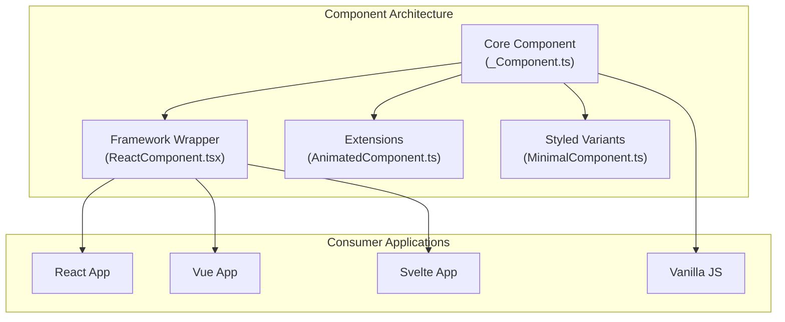
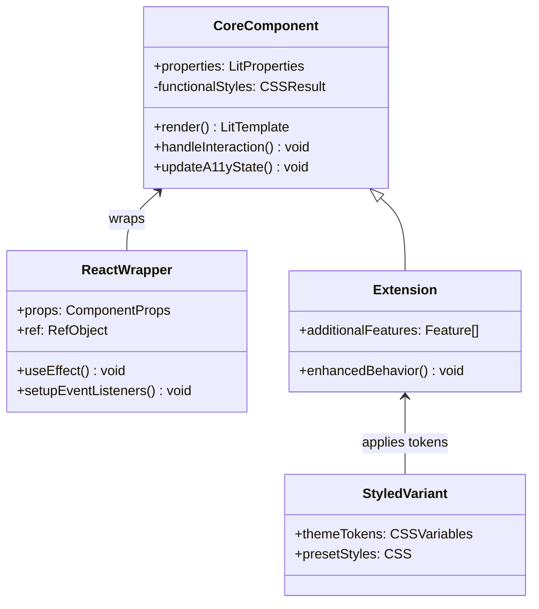

# agnosticui-core

AgnosticUI Core Library - Framework-agnostic, upgrade-safe web components built with Lit.

## Architecture Overview

AgnosticUI uses a **Minimalist & Highly Themeable** architecture where components provide beautiful, minimal defaults that are fully customizable via design tokens (`--ag-*` CSS custom properties).



## Component Layers

### 1. Core Layer (`_Component.ts`)
- **Immutable** canonical web component
- Built with Lit for maximum compatibility
- Contains all functional behavior and accessibility
- Minimal visual styling via `--ag-*` design tokens

### 2. Framework Wrappers
- **React/Vue/Svelte** specific adapters
- Handle framework-specific patterns (props, events, slots)
- Maintain type safety and developer experience

### 3. Extensions
- **Optional** enhanced versions with additional features
- Example: `AnimatedAccordion` adds smooth transitions
- Built on top of core components

### 4. Styled Variants
- **Optional** pre-styled component versions
- Theme-aware via design tokens
- Examples in `styled/` directories (e.g., `MinimalAccordion.ts`)

## Data Flow

```mermaid
sequenceDiagram
    participant User
    participant Framework as Framework Wrapper
    participant Core as Core Web Component
    participant DOM
    
    User->>Framework: Render component with props
    Framework->>Core: Set attributes/properties
    Core->>DOM: Create shadow DOM with slots
    Note over Core: Apply functional CSS only
    
    User->>Framework: Interact (click, keyboard)
    Framework->>Core: Forward event listeners
    Core->>Core: Handle accessibility & state
    Core->>Framework: Emit custom events
    Framework->>User: Trigger callbacks/updates
```



## Component Structure



## Directory Structure

```
src/components/
├── Accordion/
│   ├── core/
│   │   ├── _Accordion.ts          # Immutable core
│   │   └── _Accordion.spec.ts     # Core tests
│   ├── react/
│   │   ├── ReactAccordion.tsx     # React wrapper
│   │   └── useAccordion.ts        # React hooks
│   ├── extensions/
│   │   └── AnimatedAccordion.ts   # Enhanced version
│   ├── styled/
│   │   └── MinimalAccordion.ts    # Pre-styled variants
│   ├── helpers/
│   │   └── accordion-state.ts     # Shared utilities
│   └── Accordion.ts               # Public exports
```

## Key Principles

### Minimalist & Highly Themeable Philosophy
- ✅ **Minimal Visual Styling**: Clean defaults via `--ag-*` design tokens
- ✅ **Functional CSS**: Layout, positioning, component structure
- 🎨 **Complete Customization**: Override any design token for white-labeling
- 🎯 **Result**: Production-ready components with enterprise-grade theming

### Upgrade Safety: Encapsulated Core with Adapter Pattern
- **Immutable Core**: `_Component.ts` files are canonical and upgrade-safe
- **Adapter Layer**: Framework wrappers absorb breaking changes between versions
- **Isolated Customization**: Extensions and styled variants evolve independently
- **Safe Overrides**: Customize via design tokens without touching core implementations
- **Result**: Your customizations survive library upgrades seamlessly

### Framework Agnostic
- Web Components work in any framework
- Framework-specific wrappers provide optimal DX
- Progressive enhancement from vanilla JS to framework-specific features

## Usage

```typescript
// Direct web component usage
import 'agnosticui-core/accordion';

// React wrapper
import { ReactAccordion } from 'agnosticui-core/react';

// Enhanced version with animations
import { AnimatedAccordion } from 'agnosticui-core/extensions/animated-accordion';

// Pre-styled variant
import { MinimalAccordion } from 'agnosticui-core/accordion/styled';
```

## Development Workflow

1. **Core First**: Implement behavior in `_Component.ts`
2. **Test Thoroughly**: Ensure accessibility compliance
3. **Wrap Frameworks**: Create framework-specific adapters
4. **Extend Carefully**: Add optional enhancements
5. **Theme via Tokens**: Customize using `--ag-*` design tokens
6. **Create Variants**: Build pre-styled versions in `styled/` directories